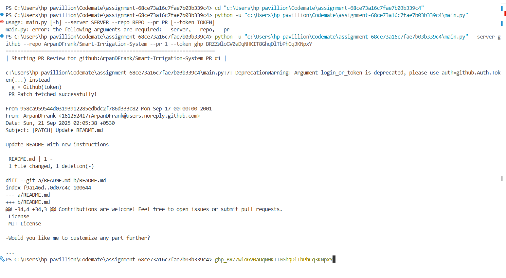

# CodeMate Assignment – GitHub PR Review Tool

## Assignment Overview
This assignment implements a simple **Pull Request (PR) review tool** using Python.  
It connects to GitHub, fetches the PR patch, and displays the changes in the terminal.  
This tool demonstrates the use of **GitHub API**, **Python scripting**, and **requests handling**.

---

## Features
- Connects to a GitHub repository using a **Personal Access Token**.  
- Fetches the patch of a specified Pull Request.  
- Displays a preview of the PR patch in the terminal.  
- Handles errors gracefully if PR does not exist or token is invalid.

---

## Prerequisites
- Python 3.8 or above
- GitHub Personal Access Token (PAT) with **repo access**  
- Installed Python packages:
  - `PyGithub`
  - `requests`

You can install dependencies via:

```bash
pip install -r requirements.txt
````

---

## Folder Structure

```
assignment-68ce73a16c7fae7b03b339c4/
│
├── main.py               # Main script to fetch PR
├── requirements.txt      # Python dependencies
├── README.md             # This file
└── pr_agents/            # folder for helper modules
```

---

## How to Run

1. Open a terminal in the assignment folder.
2. Run the script using the following command:

```bash
python main.py --server github --repo <owner/repo> --pr <PR_NUMBER> --token <YOUR_GITHUB_TOKEN>
```

**Example:**

```bash
python main.py --server github --repo ArpanDFrank/assignment-68ce73a16c7fae7b03b339c4 --pr 1 --token ghp_yourTokenHere
```

> You can also set the GitHub token as an environment variable `GITHUB_TOKEN` and omit `--token`.

---

## Expected Output

* On successful fetch, the script prints the first 1000 characters of the PR patch.
* If the PR number is invalid or token is incorrect, an error message is displayed.


---

## Demo Video

* A demo video showing the tool in action is included in the submission folder.

---

## Notes

* Ensure your GitHub token has **access to the repository** if it is private.
* Remove any unnecessary system files (`.venv`, `__pycache__`) before submission.

---

## Author

* Name: **\[Your Name]**
* GitHub: [https://github.com/ArpanDFrank](https://github.com/ArpanDFrank)

```

---

```
